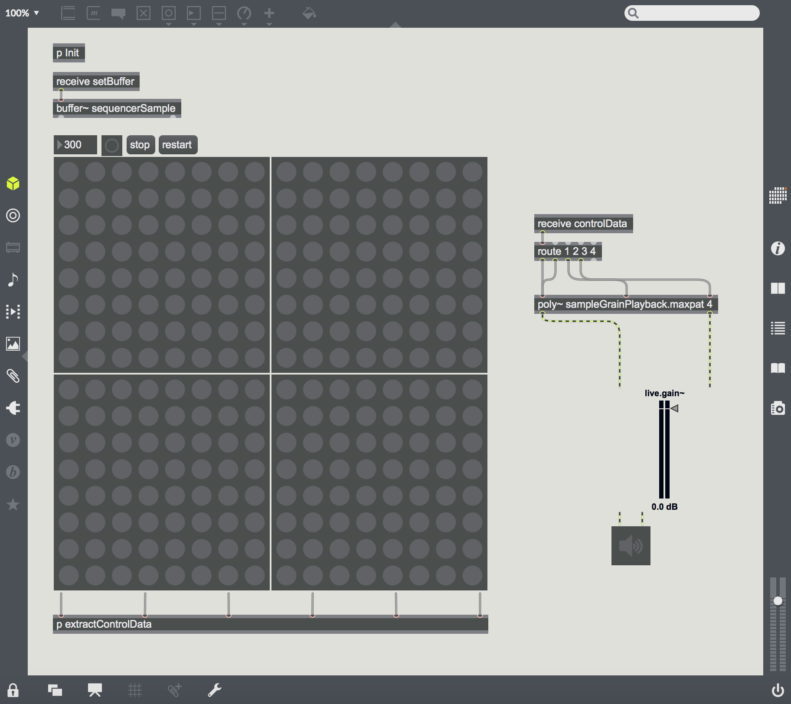
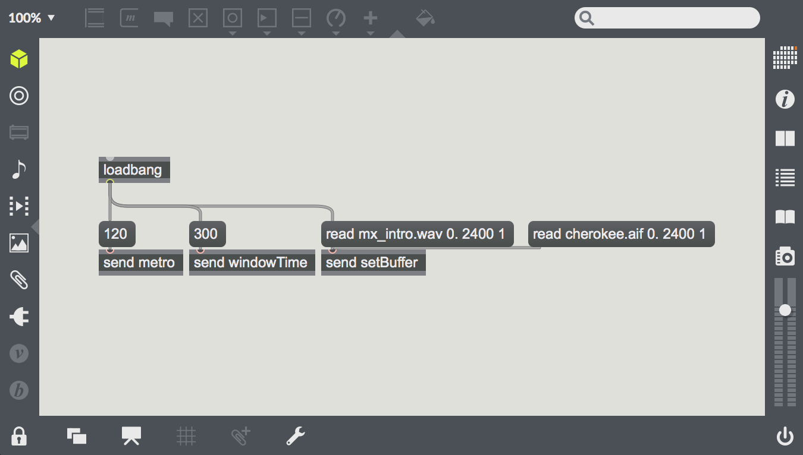
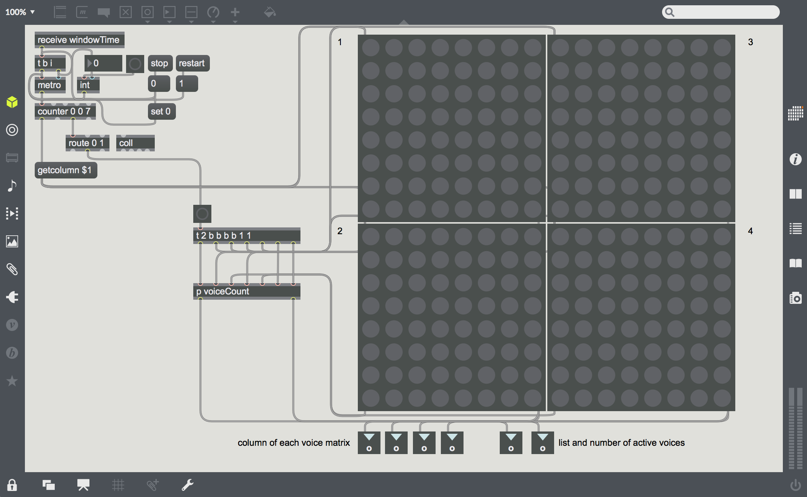
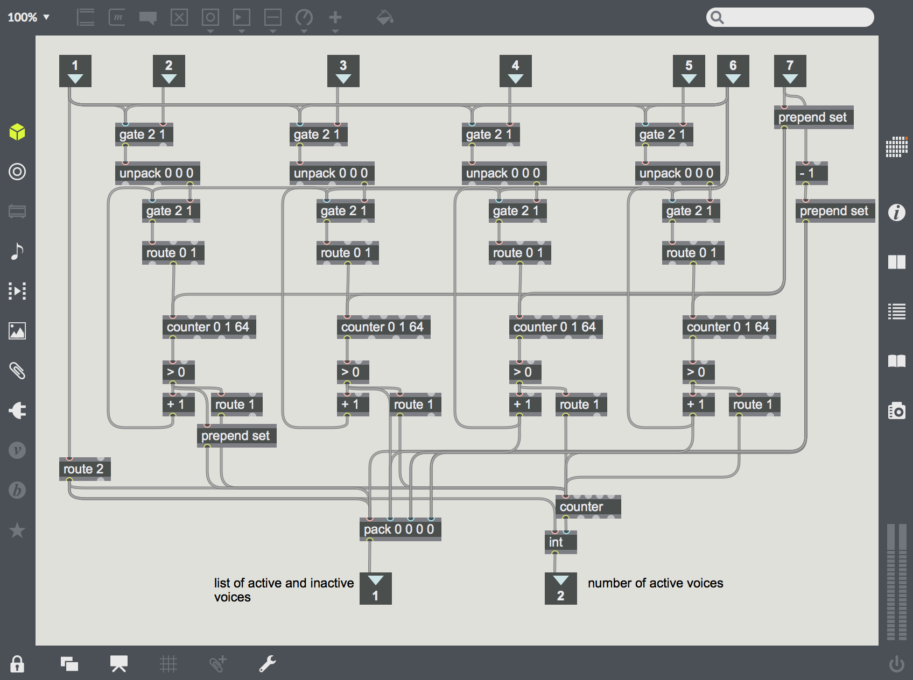
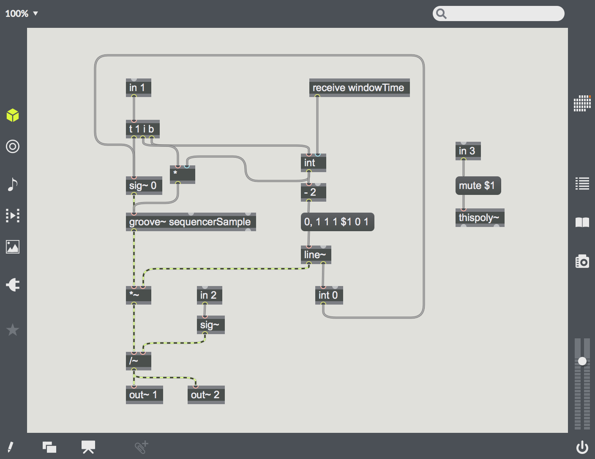

# GranularSequencer
Prototype of a 4 channel polyphonic granular sequencer in Max MSP

The basic idea is for you to be able to split up a sample into granular chunks and create loops while dynamically reconfiguring the order of those chunks in 4 different voices.

The initial setting sets the speed of the metronome, as well as the size (in samples) of the buffer and the grains. It also loads an audio file into the buffer. All of this can be changed during use.

The use interface consists of 4 control panels, which are being queried every beat. Each horizontal column represents a beat in the loop, while each row is a grain of the sample. 

This patch formats the control data to send to the poly~:

Here's an unedited sample of the sequencer, with two different samples:

This is just a prototype. There are many aspects of this that need refinement:
- A better user interface, ideally something that allows you to dynamically alter the number of grains/beats in the bar
- Multiple transports, which allow for polyrhythms
- Multiple buffers
- Spatial and Effects processing of the voices to create separation
- Ability to control using external controller, like a Wacom tablet or Leap Motion
